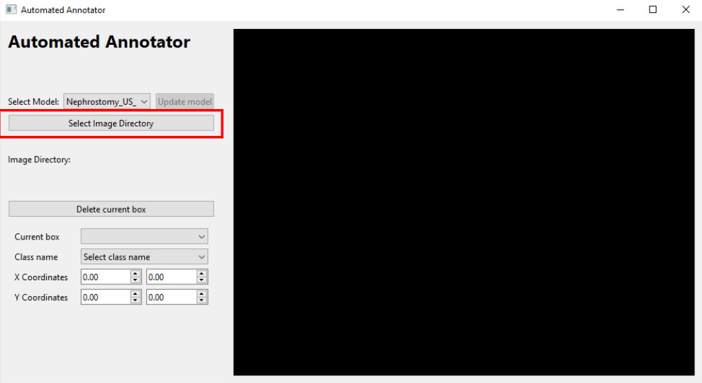

# Automated_Annotator

## Overview

### Abstract
Annotation for surgical instrument detection research is extremely time-consuming and tedious, leading to a scarcity of annotated datasets, and those that do exist tend to be small. Currently, researchers studying surgical instrument detection in open or percutaneous applications must build new datasets from scratch, a process that can take many months or even years using current annotation practices. To address this challenge, we propose a novel pipeline based on active learning that reduces the human effort required to produce annotated datasets while maintaining high-quality labels. This approach involves annotating a small subset of images and iteratively updating an object detection network. This trained network is then used to suggest bounding box annotations for human annotators to review and correct.

This work is currently in submission. The full paper can be found [here](https://labs.cs.queensu.ca/perklab/404).


### Description
In essence, the Automated_annotator is a tool that can be used to expedite the process of annotation using machine learning.

This pipeline resembles a typical active learning pipeline with a few key differences. The primary difference is that the goal of the pipeline is not to simply train an object detection model, instead the goal is to use the trained model to assist a human reviewer to annotate all samples. This goal requires two modifications to the active learning pipeline. The first change is that all images will be annotated as opposed to selecting only a small sample to annotate. The second change involves using the trained model to produce suggested bounding box annotations, which a human annotator can then review and correct.


When using this pipeline, all data is processed securely on your local system, with no information transmitted externally. All operations are entirely in-house, ensuring that your data remains private and protected within your own infrastructure.

---

## Dependencies

Install torch first. The installation of all libraries marked (satisfied) should already be satisfied upon the installation of the remaining libraries.

- torch (https://pytorch.org/get-started/locally/)
- ultralytics
- torchvision (satisfied)
- transformers
- PyQt6
- superqt
- sklearn
- opencv-python (satisfied)
- PIL (satisfied)
- yaml (satisfied)
- numpy (satisfied)
- pandas (satisfied)

(Note: 23/09/23) - As of the current date, it is recommened to install torch using conda. The bash commands can be found below.

GPU enabled:
```bash
conda install pytorch torchvision torchaudio pytorch-cuda=11.8 -c pytorch -c nvidia
```

CPU only:
```bash
conda install pytorch torchvision torchaudio cpuonly -c pytorch
```

---

## Installation and set up

### 1. Clone the repository
```bash
git clone https://github.com/username/repository-name.git
```

### 2. Set up the environment
List of Dependencies can be found above.

### 3. Run the following command in console

```bash
python <path to repo>/Automated_Annotator.py
```

---

## Usage

### 1. Creating a model
The first time using the automated_annotator. You will need to create a model. Click the dropdown next to "Select Model", select "Create new model", and name your model. Note that you are only required to do this on your first use. On subsequent uses simply select the model you have already created a named.


### 2. Select an image directory
Once your model is selected, you can find your images. Use the "select Image Directory" button to open your file explorer and locate the location of your desired directory.



Note: The application expects each video to be in its own directory with a single jpg or png for each frame that you wish to annotate.

### 3. Selecting initial images
Once an image directory has been chosen.The application will execute a clustering algorithm to select the best images for you to begin annotating. This process can take several minutes and during this time the annotator will be unresponsive. The application's progress will however be printed in the command prompt window.

### 4. Annotating Images
The first batch of images will need to be manually annotated.

To add a new box:
- Select "Add new box" from the current box selector.
- Select the class using the class selector.
  - If no classes have been added, select "Add new class", a pop-up window will appear prompting you for your new class name.
- Click and drag on the image to place your box.


To modify an existing box:
- Select the box you wish to modify using the current box selector.
- Click and drag on the image to change location (similar to the initial placing of the box).
- Use the class selector to change the class label.

The box currently being modified/placed will be shown on the image in green.

---

## Controls

| Command key | Function |
|----------|----------|
| n | move to next image |
| p | move to previous image |
| d | remove image (only functional after all images have been labelled) |
| m | cycle display modes (show all boxes, show active box only, hide all boxes) |
| b | replace current box with the box of the same class from the previously reviewed image |
| Ctrl + e | export bounding boxes to label file (only functional after all images have been labelled) |

---

## Updating the model
Once all images in the current set are complete, click "Update model". This will use the your labels to train the model and make predictions on the next batch of images.This process can take several minutes, during this process, the annotator will be unresponsive. However, progress will still be printed in the command prompt. Once the update is complete. the annotator will give you the next set of images, with predicted labels.

Moving forward, all generated labels should be reviewed and generated boxes should be corrected if needed. Continue this process until all images are complete.

---

## Exporting the labels
Upon completion of all images, update the model once more. When the model is finished updating, use the command `Ctrl + e` to export the labels. The location of the label csv file will be displayed in the command prompt.
